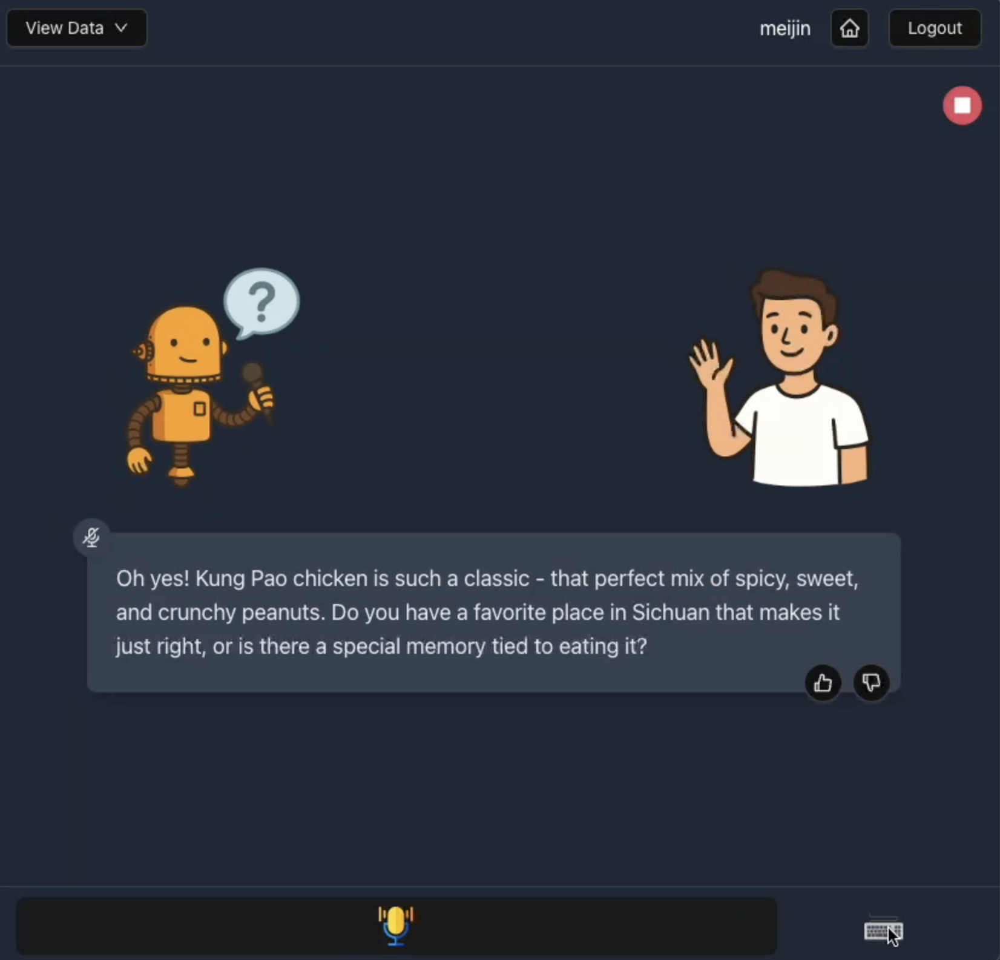

# StorySage Frontend

This is the web interface implementation of StorySage, an AI-powered framework for conversational autobiography writing. This project is based on the following research:

> **StorySage: Conversational Autobiography Writing Powered by a Multi-Agent Framework**  
> Shayan Talaei, Meijin Li, Kanu Grover, James Kent Hippler, Diyi Yang, Amin Saberi  
> arXiv:2506.14159 [cs.HC], 2025  
> [Paper](https://arxiv.org/abs/2506.14159)

For the core framework and backend implementation, visit: [StorySage](https://github.com/ShayanTalaei/StorySage)

## Key Features

- 🤝 Natural conversation flow
- 🧠 Intelligent memory management
- 📚 Structured biography creation
- 🔄 Continuous learning from interactions

## Getting Started

Follow these instructions to set up and run the project locally.

**Prerequisites:**

Ensure you have the following installed on your machine:

- [Node.js](https://nodejs.org/) (v16 or higher recommended)
- [npm](https://www.npmjs.com/) or [yarn](https://yarnpkg.com/)

## Setup

Install dependencies:

```bash
npm install
```

Create a `.env` file in the root directory. Copy the `.env.example` file and fill in the values.

## Usage

To start the development server:

```bash
npm run dev
```

Once the server starts, you can access the application by opening the URL shown in the terminal. Once you open the web page, you can start chatting via the following UI.

<p align="center">
  
</p>

## Backend Integration

This frontend is designed to work with the StorySage backend. To set up the complete system, Check the "Usage > Web UI Interaction" section in [StorySage](https://github.com/ShayanTalaei/StorySage) following its installation instructions

## Disclaimer

StorySage is an AI-powered system. Its functionality depends on third-party AI service providers that you configure via your own API keys. By using the system:

- You are responsible for providing and managing your own API keys and any associated costs with the AI provider you choose.

- Data Privacy: If you use the Web UI or any frontend deployment, your conversation data may be transmitted over the network. Please ensure that your deployment environment and network setup meet your privacy and security requirements.

- No Warranty: This project is provided “as is” without any warranties, and the maintainers are not responsible for any data loss, unauthorized access, or privacy breaches arising from how you deploy or use StorySage.

Use this software at your own discretion and ensure compliance with the terms of your chosen AI provider.

## Acknowledgments

- [React](https://reactjs.org/)
- [Tailwind CSS](https://tailwindcss.com/)
- [Vite](https://vitejs.dev/)
- [StorySage](https://github.com/ShayanTalaei/StorySage)
